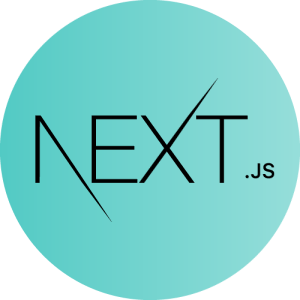
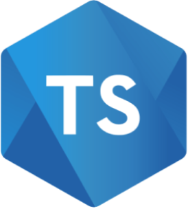

## :star: vocab-master-web
vocab-master-web is a standalone web project. Its the web application for the Vocab Master

### :eyes: Overview
Intention of the application is to provide a flexible environment for improving on vocabulary with the ability of creating and playing different type of games focused on different categories of words
<br>
<br>
The project is a web application developed using next.js, react.js and TypeScript.
<br>
<br>

 &nbsp;&nbsp; &nbsp;&nbsp; &nbsp;&nbsp;


## :rocket: Getting Started

First, run the development server:

```bash
npm run dev
# or
yarn dev
# or
pnpm dev
# or
bun dev
```

Open [http://localhost:3000](http://localhost:3000) with your browser to see the result.


